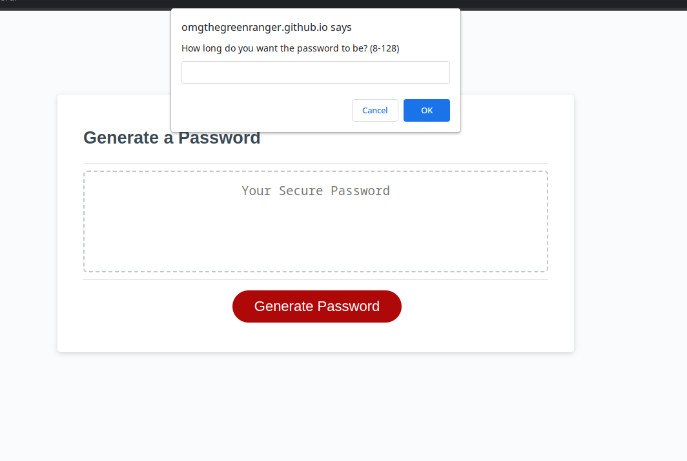

# generate-o-password

## The Task

As per the challenge details, I am asked "to modify starter code to create an application that enables employees to generate random passwords based on criteria that they’ve selected. This app will run in the browser and will feature dynamically updated HTML and CSS powered by JavaScript code that you write. It will have a clean and polished, responsive user interface that adapts to multiple screen sizes."

The HTML and CSS were already in place; nothing needed to be changed there. However, the Javascript is clean and sharp; this was done with assistance with a tutor (which I was not expecting, but absolutely appreciated). I did, however, very much want to make the prompts selectable toggles via HTML and CSS.

## Usage

Easy, the site is available [here](https://omgthegreenranger.github.io/generate-o-password/), just click "Generate a Password" and it will provide one for you based on the details you answer with prompts. Ideally, it would benefit us to include a proper validator to ensure that there are characters from *each selected set* within the password; that was not in the scope of this particular project.

